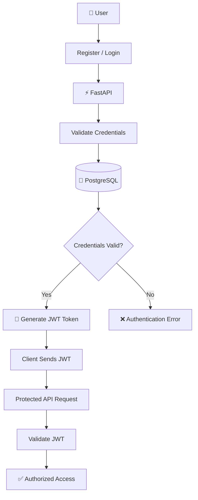
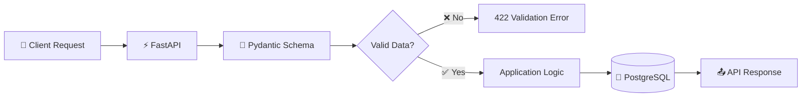
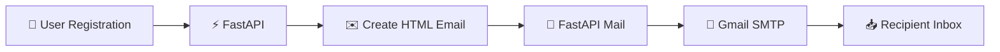
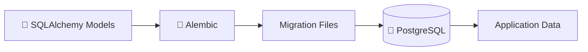

<div align="center">

# 🚀 FastAPI Task Management App

### A complete REST API built from scratch while learning FastAPI and modern backend development


<p>
  <a href="https://github.com/Ankit-2404/FastAPI_task_management_app">📂 Repository</a>
  •
  <a href="https://github.com/Ankit-2404">👨‍💻 GitHub Profile</a>
</p>

</div>

---

## 📌 About The Project

**FastAPI Task Management App** is a backend REST API that I developed **from scratch** as part of my FastAPI learning journey.

Instead of simply using a ready-made project, I built this application step by step while learning and implementing the concepts behind a modern backend application.

The project brings together the core concepts I learned in FastAPI, including:

- REST API development
- Request and response validation
- PostgreSQL database integration
- SQLAlchemy ORM
- User authentication
- JWT authorization
- Password hashing
- Alembic database migrations
- Email functionality
- Environment variables
- API testing
- Interactive API documentation

> **Learning by building:** Every major component of this project was implemented as I progressed through my FastAPI learning roadmap.

---

## ✨ Features

### 🔐 Authentication & Authorization

- User registration
- User login
- JWT-based authentication
- Protected API endpoints
- Password hashing
- Token-based authorization

### 📝 Task Management

- Create tasks
- Retrieve tasks
- Update tasks
- Delete tasks
- RESTful API design

### 🗄️ Database

- PostgreSQL integration
- SQLAlchemy ORM
- Database models
- Database relationships
- Alembic migrations

### 📧 Email

- Registration confirmation emails
- HTML email content
- FastAPI Mail integration
- Gmail SMTP integration

### ✅ Validation

- Pydantic schemas
- Request validation
- Response validation
- Structured API data

### 📚 API Documentation

FastAPI automatically provides:

- Swagger UI
- ReDoc

### 🧪 API Testing

The API can be tested using:

- Swagger UI
- Postman

### ⚙️ Configuration

- Environment variables
- `.env` configuration
- Sensitive credentials kept outside the source code

---

## 🧰 Tech Stack

| Technology | Purpose |
|---|---|
| 🐍 **Python** | Backend programming |
| ⚡ **FastAPI** | REST API framework |
| 🧩 **Pydantic** | Data validation and schemas |
| 🐘 **PostgreSQL** | Relational database |
| 🔗 **SQLAlchemy** | ORM and database interaction |
| 🔄 **Alembic** | Database migrations |
| 🔑 **JWT** | Authentication |
| 🔐 **Password Hashing** | Secure password storage |
| 📧 **FastAPI Mail** | Email functionality |
| 📮 **Gmail SMTP** | Email delivery |
| 🌱 **python-dotenv** | Environment variables |
| 🚀 **Uvicorn** | ASGI server |
| 🧪 **Postman** | API testing |
| 🔧 **Git & GitHub** | Version control |

---

## 🏗️ Project Structure

```text
FastAPI_task_management_app/
│
├── migration/
│   └── ...                  # Alembic migration files
│
├── src/
│   └── ...                  # Application source code
│
├── main.py                  # FastAPI application entry point
├── alembic.ini              # Alembic configuration
├── requirement.txt          # Python dependencies
├── .gitignore               # Git ignored files
├── .env                     # Local secrets - not committed
└── README.md                # Project documentation
```

---

# 🔄 Application Workflows

## 🔐 Authentication Flow

The application uses JWT-based authentication to protect private API endpoints.



---

## ✅ Request Validation Flow

Pydantic schemas are used to validate incoming request data before the application processes it.



---

## 📧 Email Flow

The application uses FastAPI Mail and Gmail SMTP to send registration-related emails.



---

## 🗄️ Database & Migration Flow

Alembic is used to manage changes to the PostgreSQL database schema.



---

# ⚙️ Getting Started

## Prerequisites

Make sure you have the following installed:

- Python 3.x
- PostgreSQL
- Git

---

## 1️⃣ Clone the Repository

```bash
git clone https://github.com/Ankit-2404/FastAPI_task_management_app.git
```

Move into the project directory:

```bash
cd FastAPI_task_management_app
```

---

## 2️⃣ Create a Virtual Environment

### Windows

```bash
python -m venv .venv
```

Activate it using PowerShell:

```powershell
.venv\Scripts\Activate.ps1
```

Or using Git Bash:

```bash
source .venv/Scripts/activate
```

---

## 3️⃣ Install Dependencies

```bash
pip install -r requirement.txt
```

---

# 🔐 Environment Variables

Create a `.env` file in the root directory.

Example:

```env
DATABASE_URL=your_database_connection_string

SECRET_KEY=your_secret_key

MAIL_USERNAME=your_email@gmail.com
MAIL_PASSWORD=your_gmail_app_password
MAIL_FROM=your_email@gmail.com
```

### ⚠️ Security

**Never commit your real `.env` file to GitHub.**

Your `.gitignore` should contain:

```gitignore
.env
.venv/
__pycache__/
*.pyc
```

Never expose:

- Database passwords
- Gmail/App passwords
- JWT secret keys
- API keys
- Other private credentials

---

# 🗄️ Database Setup

The project uses **PostgreSQL** as the database and **SQLAlchemy** for database interaction.

**Alembic** is used to manage database schema changes.

## Apply Existing Migrations

```bash
alembic upgrade head
```

## Create a New Migration

```bash
alembic revision --autogenerate -m "describe your change"
```

Then apply the migration:

```bash
alembic upgrade head
```

---

# ▶️ Run the Application

Start the FastAPI development server:

```bash
uvicorn main:app --reload
```

The application will normally be available at:

```text
http://127.0.0.1:8000
```

---

# 📚 API Documentation

FastAPI automatically generates interactive API documentation.

## Swagger UI

Open:

```text
http://127.0.0.1:8000/docs
```

Swagger UI allows you to:

- View available endpoints
- View request schemas
- View response schemas
- Send API requests
- Test authentication
- Inspect API responses

## ReDoc

Open:

```text
http://127.0.0.1:8000/redoc
```

---

# 🔑 Authentication

The project implements JWT-based authentication.

The general authentication process is:

```text
Register
   ↓
Hash Password
   ↓
Store User
   ↓
Login
   ↓
Verify Credentials
   ↓
Generate JWT
   ↓
Send Token
   ↓
Access Protected APIs
```

Passwords are hashed before being stored in the database.

Protected endpoints require a valid JWT token.

---

# 📧 Email Functionality

The project includes email functionality using **FastAPI Mail** and **Gmail SMTP**.

The application can send registration-related emails using HTML content.

Email credentials are loaded through environment variables instead of being hard-coded into the source code.

The general flow is:

```text
Registration
      ↓
FastAPI Application
      ↓
Create Email
      ↓
FastAPI Mail
      ↓
Gmail SMTP
      ↓
Recipient's Inbox
```

---

# 🧪 Testing the API

The APIs can be tested using **Swagger UI** or **Postman**.

### HTTP Methods

```text
GET
POST
PUT
DELETE
```

Postman can be used to test:

- Request bodies
- API responses
- HTTP status codes
- Authentication
- Protected endpoints
- JWT tokens

---

# 🧠 What I Learned

Building this project helped me understand how the different components of a FastAPI backend work together.

## ⚡ FastAPI

- Creating FastAPI applications
- API routing
- HTTP methods
- Request handling
- Response handling
- Dependencies
- API documentation

## 🗄️ Database

- PostgreSQL
- SQLAlchemy
- ORM concepts
- Database models
- Database relationships
- Database connectivity
- Alembic migrations

## 🔐 Authentication

- User registration
- Password hashing
- JWT creation
- JWT validation
- Protected routes
- Authorization

## 🛠️ Backend Development

- REST API design
- Environment variables
- `.env` configuration
- SMTP
- Email integration
- API testing
- Project organization
- Git and GitHub

---

# 🎯 Project Goal

The main goal of this project was to move beyond learning FastAPI concepts individually and understand how they work together in a real backend application.

I built this project **step by step from scratch** during my FastAPI learning journey.

The project represents my practical progression through:

```text
Python
   ↓
FastAPI
   ↓
REST APIs
   ↓
Pydantic
   ↓
PostgreSQL
   ↓
SQLAlchemy
   ↓
Authentication
   ↓
JWT
   ↓
Alembic
   ↓
Email Integration
   ↓
Backend Development
```

---

# 🚧 Future Improvements

Some possible improvements for future versions include:

- 🌐 Build a frontend for the API
- 👥 Add role-based authorization
- 🔎 Add advanced task filtering and searching
- 📄 Add pagination
- 🧪 Add automated unit and integration tests
- 🐳 Dockerize the application
- 🔄 Add CI/CD with GitHub Actions
- ☁️ Deploy the application to a cloud platform
- 📊 Add API monitoring and logging

---

# 👨‍💻 Author

## Ankit Singh

**B.Tech Computer Science**  
Poornima University, Jaipur

[](https://github.com/Ankit-2404)

---

<div align="center">

### ⭐ If you found this project interesting, consider giving the repository a star!


</div>
